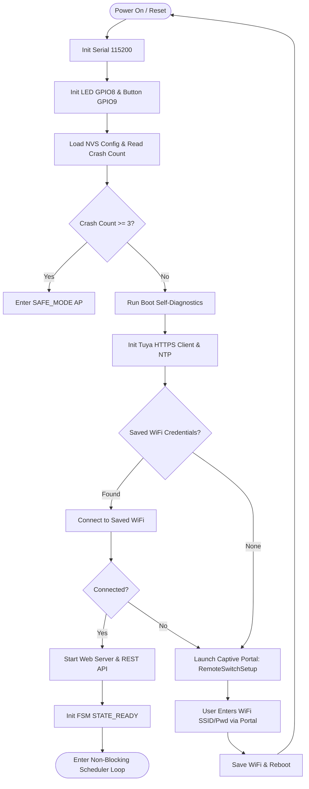
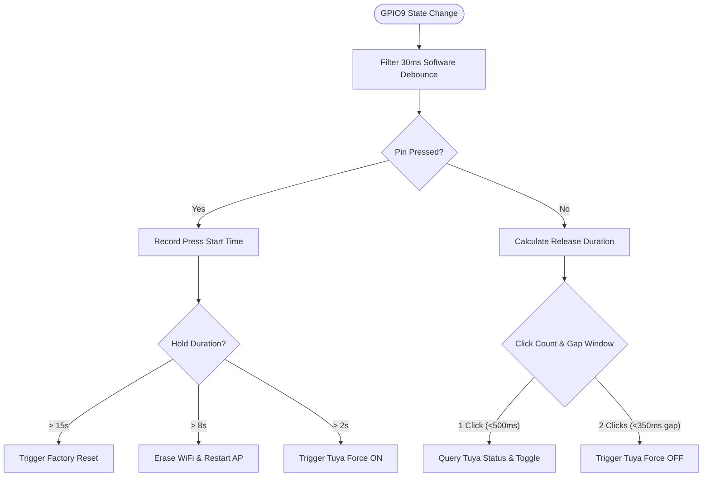
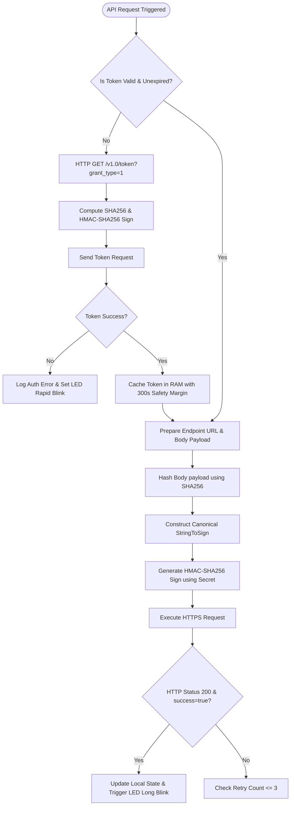

# System Workflows & Flowcharts

This document provides visual flowcharts for boot initialization, button gesture recognition, Tuya HTTPS request authorization, and WiFi state management.

---

## 1. System Boot Flowchart

---

## 2. Button Multi-Gesture State Machine (GPIO9)

---

## 3. Tuya Cloud OpenAPI Signature Flowchart

